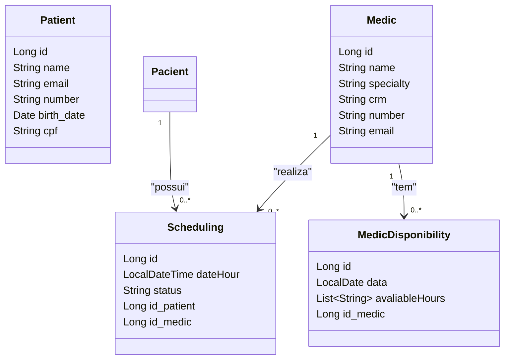

<h1 align="center">
Hospital API
</h1>

## 📚 Project
API made for a hospital, with Services and HTTP methods.

## 🔍 Operation Flows

1. **Find (GET Method):** Return a List or specific class called.
2. **Create (POST Method):** Create a info on database.
3. **Modify (PUT Method):** Modify a info setted in the persistence.
4. **Delete (DELETE Method):** Picks a info and delete.

## 👨‍💻 Endpoints

<b>Medic</b>

<b>Patient</b>

<b>Schedule</b>

<b>Medic Disponibility</b>

## 💻 Technology

- Language: Java
- Framework: Spring Framework
- Database: PostgreSQL
- Maven
- Junit5
- Mockito
