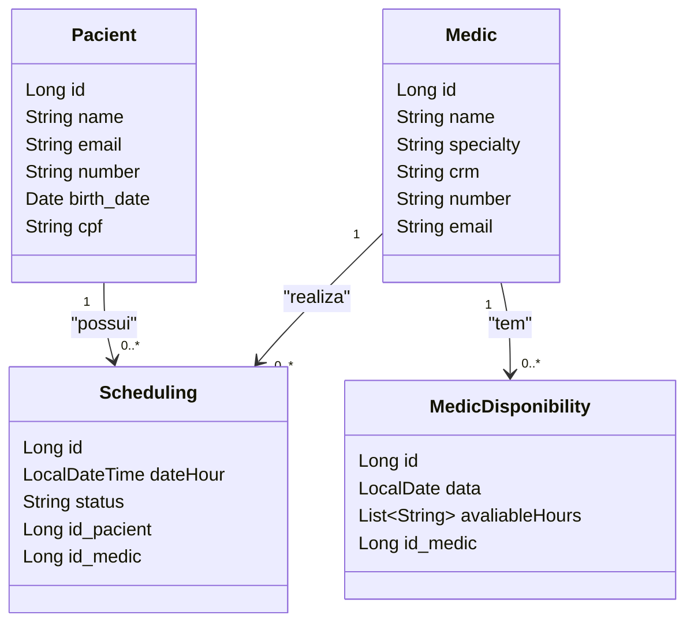

<h1 align="center">
Hospital API
</h1>

```mermaid
classDiagram
    class Pacient {
        Long id
        String name
        String email
        String number
        Date birth_date
        String cpf
    }

    class Medic {
        Long id
        String name
        String specialty
        String crm
        String number
        String email
    }

   class MedicDisponibility {
        Long id
        LocalDate data
        List~String~ avaliableHours
        Long id_medic
    }

    class Scheduling {
        Long id
        LocalDateTime dateHour
        String status
        Long id_pacient
        Long id_medic
    }

    Pacient "1" --> "0..*" Scheduling : "possui"
    Medic "1" --> "0..*" Scheduling : "realiza"
    Medic "1" --> "0..*" MedicDisponibility : "tem"
```

